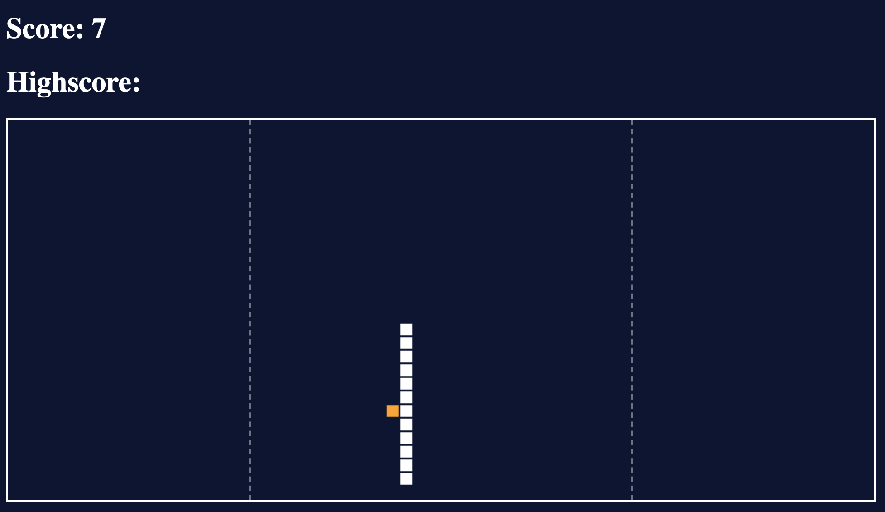

# Snake Game

## One Day Builds **# 1.**

**Total time spent:** 2.5 hours

> **Pro tip:** The code of this snake game is very dirty. I wouldn't recommend using or copying any code (but you are free to do so if you really want to).

### How to use
1. Download this repository.
2. Open *'index.html'* in your favorite browser.
3. Start playing!

### Inspiration
- I've used [Lifely's](https://lifely.nl/) awesome hidden snake game (hidden as easter egg in their client logos) for the design.
- I've used [Chris de Leon's](https://www.youtube.com/watch?v=xGmXxpIj6vs) uber fast coding challenge as code example.